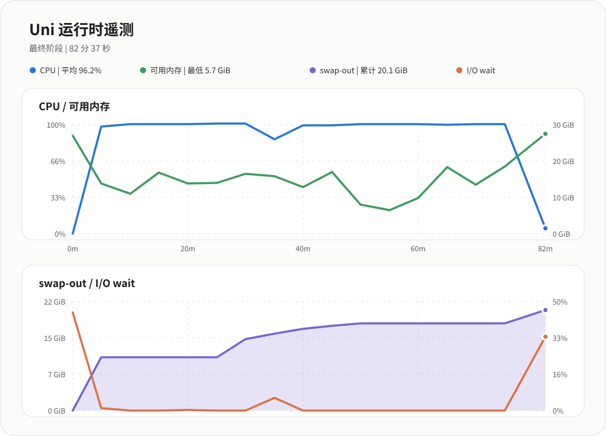

# Uni 构建系统

Uni 是 uwuAOSP 的本机构建调度器。它仍使用 Soong、Kati 和 Ninja 生成并执行 Android 构建规则，但会保存构建图状态、拆分完整构建的关键阶段，并根据实时资源为高内存任务分配独立并发池。

```sh
source build/envsetup.sh
lunch uwu_nabu-cp2a-userdebug
uni -j18 otapackage
```

模块增量构建使用相同入口：

```sh
uni -j18 SystemUI Settings Launcher3QuickStep
```

## 相比 Make 做了什么

原生 `make`/`m` 把整个 Ninja 图交给统一的全局并发。Uni 在此基础上增加：

- **构建图复用**：记录产品、版本、变体、目标参数、图文件状态和构建源码指纹。条件未变化时跳过重复准备。
- **关键路径前置**：根据历史任务时长优先处理长任务，并把 R8 目标分散到各阶段，减少尾部集中等待。
- **内核阶段隔离**：完整构建可先执行嵌套内核目标，避免内核链接与 R8、Kotlin 等高内存任务同时争用内存。
- **独立资源池**：R8、Java、Kotlin、Rust 和其他高内存任务分别计算并发。全局 Ninja 仍保持用户指定的 `-j`。
- **Rust 并发约束**：同时考虑 `rustc` 数量和每个进程的 codegen units，避免 LLVM 后端二次放大 CPU 与内存并发。
- **分段恢复**：阶段完成后保留 Ninja 恢复状态。持续内存压力中止时，等待系统恢复并以较小的自动资源池重试，已完成输出继续复用。
- **编译缓存**：识别并记录 ccache 命中，按磁盘余量维护缓存上限。
- **可观测性**：默认生成输出日志和调试报告，记录阶段耗时、内存、swap、PSI、CPU、进程峰值、资源池和源码版本。
- **终端界面**：紧凑 TUI 显示 Graph、Kernel、Startup、Main、R8 和内存状态；支持详情、复制模式和 Ctrl+C 完整终止进程树。

## 资源计算

没有显式覆盖时，Uni 读取 `MemAvailable`，预留 3 GiB 系统空间后估算资源池：

| 任务 | 估算内存 |
| --- | ---: |
| Java | 2 GiB/任务 |
| Rust | 2 GiB/任务，并受 codegen units 限制 |
| 高内存任务 | 4 GiB/任务 |
| R8 | 5 GiB/任务 |
| Kotlin | 5 GiB/任务 |

Android.bp 分析单独设置 Go 堆上限。它会为 Soong 的非 Go 堆内存保留至少 4 GiB，并根据总内存与当前可用内存计算，而不是把整机内存全部交给 Go GC。

这些值是并发准入预算，不是单个进程的硬内存限制。用户显式设置的池大小优先于自动计算。

## 构建图与增量恢复

正常复用要求产品、release、variant、目标参数、Ninja 图及构建系统源码指纹一致。`Android.bp`、`Blueprints`、Make 文件、Soong、Blueprint 或产品配置变化时，Uni 会重新准备图。

以下参数只用于已确认产物状态的恢复场景：

| 参数 | 行为 |
| --- | --- |
| `--trust-output` | 跳过恢复输出的新鲜度校验 |
| `--assume-existing` | 接受 Ninja 日志缺失但磁盘存在的输出，同时启用 `--trust-output` |
| `--force-reuse` | 跳过源码新鲜度检查，强制复用保存的图 |

它们不会让真实依赖变化消失。源码、产品、分支或构建规则已变化时，应使用普通增量构建让 Uni 更新图。

## 常用命令

```sh
# 查看调度，不运行 Ninja
uni --plan -j18 otapackage

# 本次重建完整 R8 索引
uni --dev -j18 otapackage

# 持久开启 R8 索引自动刷新
uni --dev-auto -j18 otapackage

# 清理 Uni/Soong 构建日志，不删除编译产物
uni --clean-logs

# 关闭本次详细调试报告
uni --no-debug -j18 SystemUI
```

## Clean build 对比



| 构建入口 | 用时 |
| --- | ---: |
| 原生 Make | 5:19:04 |
| Uni | 3:25:43 |

Uni 在该次对比中节省 **1:53:21**，总用时减少 **35.5%**。按完成速度计算约为 Make 的 **1.55 倍**，等效吞吐提高约 **55.1%**。

测试主机为 Intel Core Ultra 5 125H，14 核 18 线程，约 32 GiB 内存、50 GiB swap 和 NVMe SSD。两组时间由用户在同一主机上的完整 clean build 记录提供，不是跨设备通用结论。源码与 manifest 版本、温度、后台负载、存储缓存、ccache、swap 和目标产品都会造成误差。

## 输出与排查

构建结束时，Uni 只输出一份结果摘要，包括阶段数、最低可用内存、swap-out、包或输出目录和总时长。默认日志位于 `OUT_DIR`：

```text
uwuCli-output_<timestamp>.log
uwuCli-debug-report_<timestamp>.log
```

失败时应先读取日志中的第一个真实编译错误。末尾的 `FAILED: ninja` 或 `signal: killed` 只说明最终状态，不能单独确定根因。
